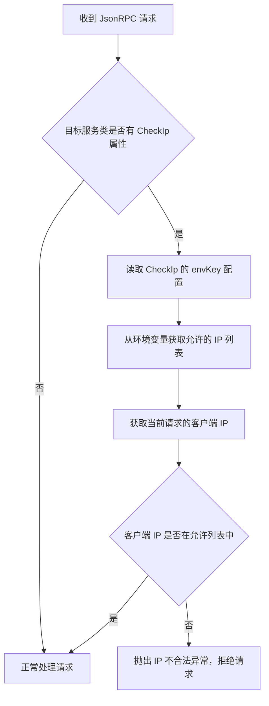

# JsonRPC 检查IP组件 - 工作流程

```mermaid
flowchart TD
    A[收到 JsonRPC 请求] --> B{目标服务类是否有 CheckIp 属性}
    B -- 否 --> Z[正常处理请求]
    B -- 是 --> C[读取 CheckIp 的 envKey 配置]
    C --> D[从环境变量获取允许的 IP 列表]
    D --> E[获取当前请求的客户端 IP]
    E --> F{客户端 IP 是否在允许列表中}
    F -- 是 --> Z
    F -- 否 --> G[抛出 IP 不合法异常，拒绝请求]
```

## 说明

- 只有被 `CheckIp` 属性注解的服务类/方法才会触发 IP 校验。
- 允许的 IP 列表通过环境变量配置，支持多个 IP 或 CIDR 段。
- 未配置 IP 列表时，默认全部放行。
- 校验失败时会抛出异常，客户端收到错误响应。
